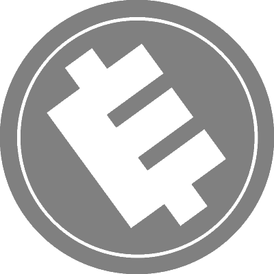
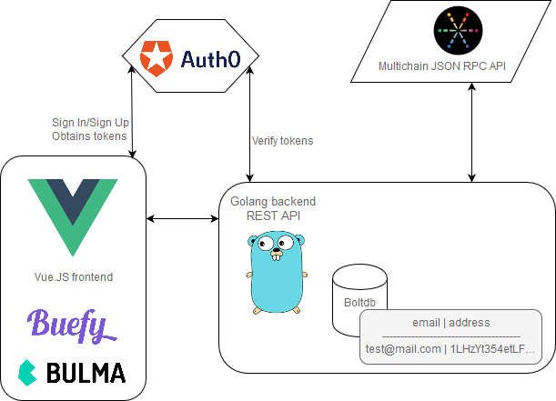

    

---

#### What is E-Coin?

E-Coin is a centralised and corporate digital assets for your E-Corp employees.

#### Centralised? What about blockchain?

E-Coin use blockchain as a storage for storing assets and transactions.

The blockchain is powered by [multichain](https://github.com/MultiChain/multichain)
for now, perfect for building a private blockchain!

#### How is it working?

E-Coin platform use a [Vue.js](https://github.com/vuejs/vue) front-end, and a Go
back-end (WIP).

#### Can I test it?

Sure! As a loyal E-Corp employee, you can register and get your first E-Coin
immediately!

The link to the demo will be soon available here. Stay tuned!

You can view a static front-end at
[https://flibustier.github.io/e-coin](https://flibustier.github.io/e-coin)
(translation will be available soon!)

---

#### Roadmap

- [x] Static front-end
- [ ] Go back-end 
- [ ] Fully functional

#### License

[MIT](http://opensource.org/licenses/MIT)
